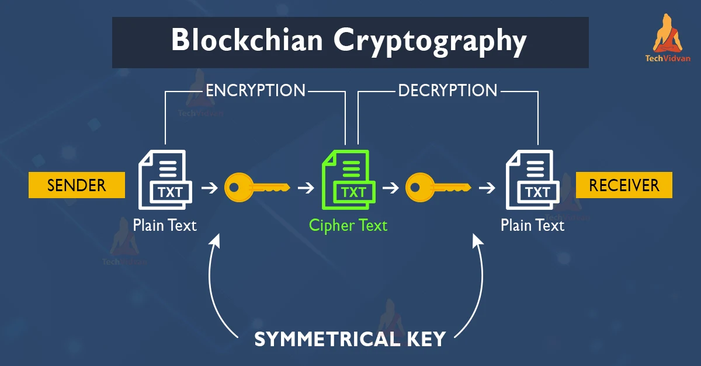
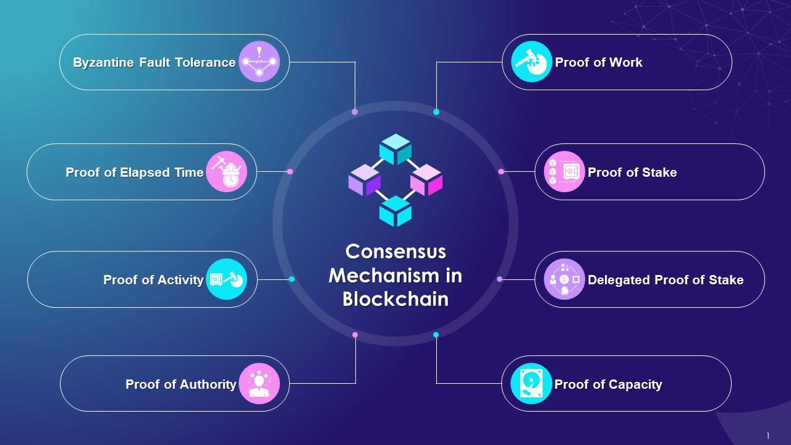
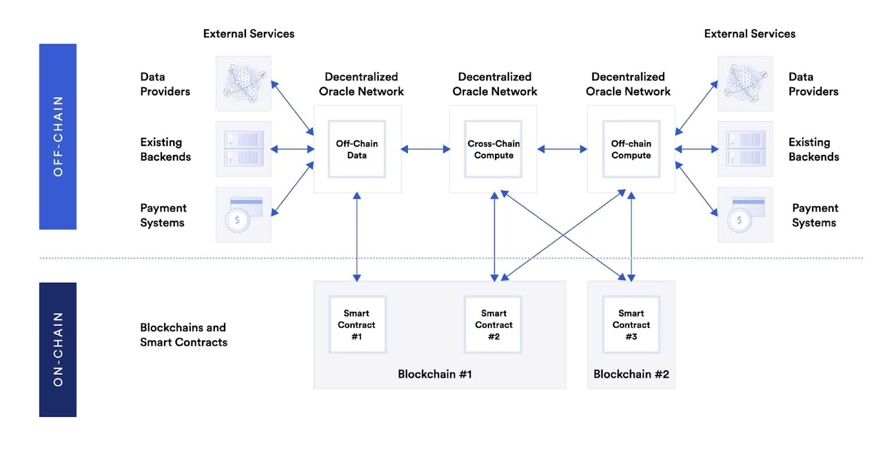
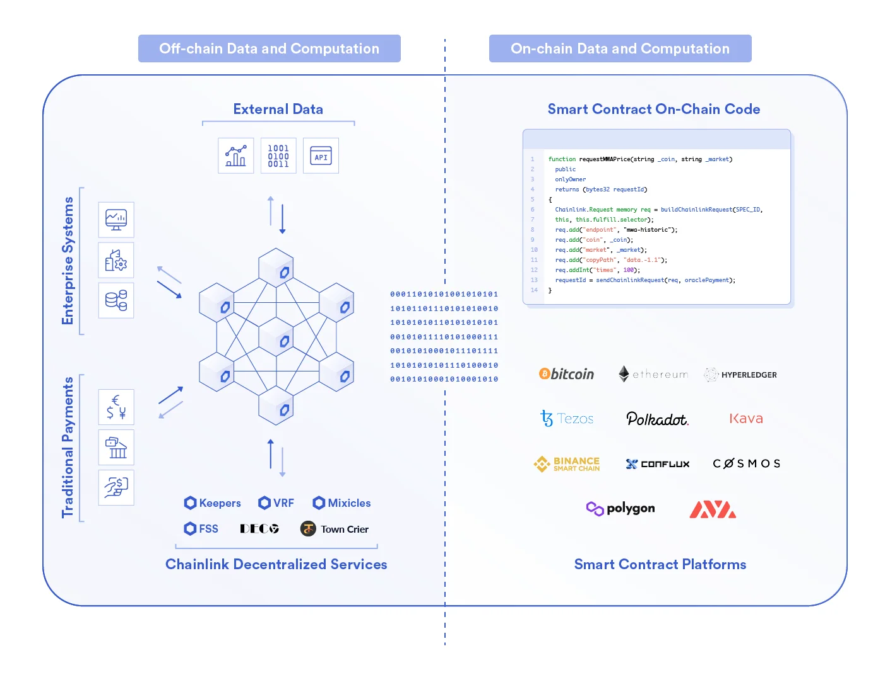
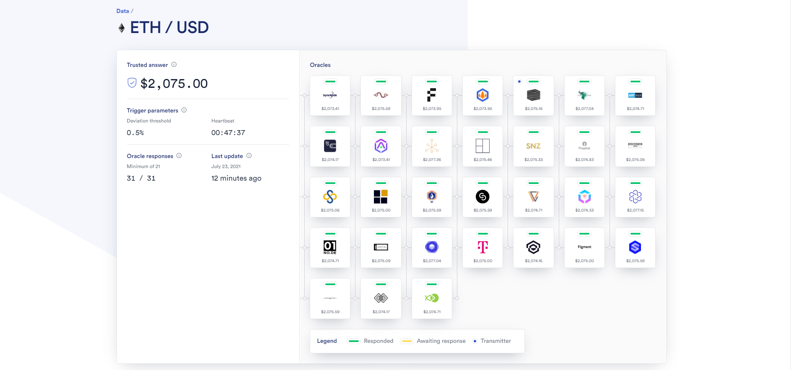

# Blockchain Local Development Guide

This guide explains how to create a decentralized application (dApp) using **Ether.js**, **Truffle**, **Ganache**, **MetaMask**, and **React**. We will write a simple smart contract in Solidity, deploy it locally using Truffle and Ganache, and interact with it via a React frontend, using MetaMask for Ethereum transactions.

## Table  of Contents
1. Basic  Blockchain Concepts
    - 1.1. [What is blockchain?](#11-what-is-blockchain)
    - 1.2. [Blockchain- In Simple Words](#12-blockchain--in-simple-words)
    - 1.3. [What is Bitcoin?](#13-what-is-bitcoin)
    - 1.4. [What are Blocks?](#14-what-are-blocks)
    - 1.5. [What are Chains?](#15-what-are-chains)
    - 1.6. [What are Nodes?](#16-what-are-nodes)
    - 1.7. [What is Mining?](#17-what-is-mining)
        - 1.7.1 [How does Mining work?](#171-how-does-mining-work)
        - 1.7.2. [What is the purpose of Mining?](#172-what-is-the-purpose-of-mining)
        - 1.7.3. [Types of Mining](#173-types-of-mining)
    - 1.8. [What are Transactions?](#18-what-are-transactions)
    - 1.9. [What are Smart Contracts?](#19-what-are-smart-contracts)
    - 1.10. [What is Cryptography?](#110-what-is-cryptography)
    - 1.11. [What are Blockchain Networks?](#111-what-are-blockchain-networks)
    - 1.12. [What is Decentralization?](#112-what-is-decentralization)
    - 1.13. [What is Consensus Mechanism?](#113-what-is-consensus-mechanism)
        - 1.13.1. [Proof of Work (PoW)](#1131-proof-of-work-pow)
            - 1.13.1.1 [How Proof of Work (PoW) works](#11311-how-proof-of-work-pow-works)
        - 1.13.2.  [Proof of Stake (PoS)](#1132-proof-of-stake-pos)
            - 1.13.2.1. [How Proof of Stake (PoS) works](#11321-how-proof-of-stake-pos-works)
            - 1.13.2.2. [How Proof of Stake differs from Proof of Work](#11322-how-proof-of-stake-differs-from-proof-of-work)
            - 1.13.2.3. [Security](#11323-security)
        - 1.13.3. [Delegated Proof of Stake (DPoS)](#1133-delegated-proof-of-stake-dpos)
            - 1.13.3.1. [Advantages of Delegated Proof of Stake (DPoS)](#11331-advantages-of-delegated-proof-of-stake-dpos)
        - 1.13.4. [Byzantine Fault Tolerance (BFT)](#1134-byzantine-fault-tolerance-bft)
            - 1.13.4.1. [What Byzantine Fault Tolerance (BFT) does](#11341-what-byzantine-fault-tolerance-bft-does)
            - 1.13.4.2. [How Byzantine Fault Tolerance (BFT) works](#11342-how-byzantine-fault-tolerance-bft-works)
            - 1.13.4.3. [Why it's important](#11343-why-its-important)
            - 1.13.4.4. [Pitfalls](#11344-pitfalls)
        - 1.13.5. [Leader-Based Consensus](#1135-leader-based-consensus)
            - 1.13.5.1. [How Leader-Based Consensus works](#11351-how-leader-based-consensus-works)
            - 1.13.5.2. [Security Issues](#11352-security-issues)
    - 1.14. [What is a Crypto Wallet?](#114-what-is-a-crypto-wallet)
    - 1.15. [What are Blockchain Oracles?](#115-what-are-blockchain-oracles)
        - 1.15.1. [What Is an Oracle Network?](#1151-what-is-an-oracle-network)
        -  1.15.2. [Types of Blockchain Oracles](#1152-types-of-blockchain-oracles)
        - 1.15.3. [Blockchain Oracle Use Cases](#1153-blockchain-oracle-use-cases)
    - 1.16. [Hybrid Smart Contracts](#116-hybrid-smart-contracts)
        - 1.16.1. [Composition of Hybrid Smart Contracts](#1161-composition-of-hybrid-smart-contracts)
        - 1.16.2. [How Hybrid Smart Contracts Combine On-Chain and Off-Chain Computation](#1162-how-hybrid-smart-contracts-combine-on-chain-and-off-chain-computation)
    - 1.17. [Chainlink](#117-chainlink)
        - 1.17.1. [How Blockchains Eliminate Counterparty Risk](#1171-how-blockchains-eliminate-counterparty-risk)
        - 1.17.2.[The Chainlink Decentralized Oracle Network](#1172-the-chainlink-decentralized-oracle-network)
    - 1.18. [Programming Languages for Smart Contracts](#118-programming-language-for-smart-contracts)
        - 1.18.1. [Solidity](#1181-solidity)
        - 1.18.2. [Vyper](#1182-vyper)
        - 1.18.3. [Rust](#1183-rust)
    - 1.19. [Smart Contract Frameworks](#119-smart-contract-frameworks)
        -  1.19.1. [Truffle](#1191-truffle)
        - 1.19.2. [Hardhat](#1192-hardhat)
        - 1.19.3. [Foundry](#1193-foundry)
        - 1.19.4. [Brownie](#1194-brownie)
    - 1.20. [Blockchain Platforms](#120-blockchain-platforms)
        - 1.20.1. [Solana](#1201-solana)
        - 1.20.2. [The Open Network (TON)](#1202-the-open-network-ton)
    - 1.21. [Blockchain Software framework](#121-blockchain-software-framework)
        - 1.21.1. [Ethereum Virtual Machine (EVM) Based](#1211-ethereum-virtual-machine-evm-based)
            - 1.21.1.1. [Ethereum](#12111-ethereum)
            - 1.21.1.2. [Polygon](#12112-polygon)
            - 1.21.1.3. [Binance Smart Chain (BNB Chain)](#12113-binance-smart-chain-bnb-chain)
            - 1.21.1.4. [Gnosis Chain](#12114-gnosis-chain)
            - 1.21.1.5. [Huobi Eco Chain](#12115-huobi-eco-chain)
            - 1.21.1.6. [Avalanche](#12116-avalanche)
            - 1.21.1.7. [Fantom](#12117-fantom)
            - 1.21.1.8. [Moonbeam/Moonriver](#12118-moonbeammoonriver)

2. Local Set-Up (Windows)
    - 2.1. [Install Node.js and npm](#21-install-nodejs-and-npm)
    - 2.2. [Install Visual Studio Code (VS Code)](#22-install-visual-studio-code-vs-code)
    - 2.3. [Install Visual Studio Code (VS Code) extensions](#23-install-visual-studio-code-vs-code-extensions)
        - 2.3.1 [Solidity by Juan Blanco](#231-solidity-by-juan-blanco)
        - 2.3.2. [ES7 React/Redux/GraphQL/React-Native snippets by rodrigovallades](#232-es7-reactreduxgraphqlreact-native-snippets-by-rodrigovallades)
        - 2.3.3. [Package Json Upgrade by codeandstuff (Optional)](#233-package-json-upgrade-by-codeandstuff-optional)
    - 2.4. [Install Ganache](#24-install-ganache)
    - 2.5. [Install MetaMask (Shown using Google Chrome)](#25-install-metamask-shown-using-google-chrome)


## 1. Basic  Blockchain Concepts

### 1.1. What is blockchain?
Blockchain technology is an advanced database mechanism that allows transparent information sharing within a business network. A blockchain database stores data in blocks that are linked together in a chain. 

  
From Adobe Stock

### 1.2. Blockchain- In Simple Words
Imagine a blockchain as a special kind of notebook, but instead of just one person writing in it, lots of people can add to it. Every time someone writes something in the notebook, it gets added in a block, like a page in the notebook. Once a block is full, it gets locked up and added to a long chain of blocks—like pages in a never-ending book!  
Here’s what makes it super cool:
- **Everyone can see it:** Once something is written, everyone can see it, but no one can erase or change it.
- **It's super safe:** Every block is locked tightly with a special code, so no one can sneak in and change the pages.
- **Everyone agrees:** Before a new block gets added, everyone has to agree that the information is correct.  

So, blockchain is like a shared notebook that keeps everyone honest, because no one can change what’s been written once it’s added to the chain! And it’s used for important stuff, like keeping track of money (like in Bitcoin) or information that everyone needs to trust.  

From mlsdev.com

### 1.3. What is Bitcoin?
Bitcoin is like special digital money that only exists on the internet. You can’t touch it like cash or coins, but you can use it to buy things online, send money to people, or save it.  
Here’s why it’s different from regular money:
- **No bank:** With regular money, you usually need a bank to send or receive money. But with Bitcoin, there’s no need for a bank—people can send Bitcoin directly to each other over the internet.
- **Blockchain:** Bitcoin uses a special technology called a blockchain to keep track of all the transactions. This makes sure everyone knows where the Bitcoins are and that no one can cheat or spend the same Bitcoin twice.
- **Limited supply:** There will only ever be a certain number of Bitcoins, like a limited-edition toy. This makes them special because there can’t be more made, unlike regular money, which banks can print more of.  

So, Bitcoin is digital money that people trust because of the way it’s tracked and how it’s shared!

  
From Depositphotos
### 1.4. What are Blocks?
- A **block** is a container for multiple transactions.
- Each block has a **unique identifier**, called a hash, which connects it to the previous block, creating a chain of blocks (hence, blockchain).
- Blocks are **immutable**, meaning once a block is added to the blockchain, its contents cannot be altered.  

  
From IG

### 1.5. What are Chains?
- A blockchain is a **decentralized**, **distributed ledger** that records transactions across a network of nodes.  
- The chain is a sequence of **blocks**, each linked to the previous block through its hash.  

  
From Adobe Stock

### 1.6. What are Nodes?
- A node is a **computer** that participates in the blockchain network.  
- Nodes verify **transactions**, **create new blocks**, and **store a copy of the blockchain**.  
- There are different types of nodes, including:  
    - **Full nodes:** Store a complete copy of the blockchain and verify all transactions.  
    - **Light nodes:** Store only a partial copy of the blockchain and rely on full nodes for verification.  
    - **Mining nodes:** Specialized nodes that solve complex mathematical puzzles to create new blocks (in PoW-based blockchains).  

  
From Medium

### 1.7. What is Mining?
Mining refers to the process of verifying and adding new transactions to a blockchain ledger. It's a critical component of the blockchain ecosystem, as it allows the network to achieve consensus and ensure the integrity of the blockchain.

#### 1.7.1. How does Mining work?
- **Transaction verification:** Miners collect and verify a group of unconfirmed transactions from the network.  
- **Block creation:** Miners create a new block and add the verified transactions to it.  
- **Hash function:** Miners use a cryptographic hash function to create a unique digital fingerprint (known as a "hash") for the block.  
- **Proof-of-work:** Miners compete to find a hash that meets a certain criteria (e.g., a certain number of leading zeros). This is known as the "proof-of-work" (PoW) consensus algorithm.  
- **Block validation:** Once a miner finds a valid hash, they broadcast the block to the network for validation.  
- **Block addition:** If the block is validated, it's added to the blockchain, and the miner is rewarded with newly minted cryptocurrency.  

#### 1.7.2. What is the purpose of Mining?
- **Secure the network:** Mining helps to secure the blockchain by making it difficult for malicious actors to alter the blockchain.  
- **Verify transactions:** Mining verifies the transactions on the blockchain, ensuring that they are valid and legitimate.  
- **Create new cryptocurrency:** Mining creates new cryptocurrency, which is used to incentivize miners to continue validating transactions and securing the network.  

#### 1.7.3. Types of Mining
- **CPU mining:** Mining using a computer's central processing unit (CPU).  
- **GPU mining:** Mining using a computer's graphics processing unit (GPU).  
- **ASIC mining:** Mining using specialized hardware designed specifically for mining (application-specific integrated circuit, or ASIC).  
- **Cloud mining:** Mining using cloud-based services, where the mining is done remotely.

### 1.8. What are Transactions?
- A transaction is an exchange of value between two parties on the blockchain.  
- Transactions are bundled together in a block and verified by nodes on the network.  
- Transactions can be:  
    - **Simple transactions:** Transfer of value between two parties.
    - **Smart contracts:** Self-executing contracts with specific rules and regulations.

### 1.9. What are Smart Contracts?
A smart contract is a **computer program or protocol** that automatically executes when certain conditions are met, and is stored on a blockchain. Smart contracts can be used to automate the execution of agreements, and are often used in **cryptocurrencies**, **decentralized finance (DeFi)**, and **non-fungible tokens (NFTs)**.  

  
From GeeksforGeeks

### 1.10. What is Cryptography?
- Cryptography is used to secure transactions and control the creation of new blocks.  
- Cryptographic techniques include:  
    - **Public-key cryptography:** Uses a pair of keys, one public and one private, to encrypt and decrypt data.
    - **Hash functions:** One-way functions that take input data and produce a fixed-size, unique output (hash).  

  
From TechVidvan

### 1.11. What are Blockchain Networks?
- A blockchain network is a decentralized system of nodes that work together to validate transactions and create new blocks.
- Blockchain networks can be:  
    - **Public:** Open to anyone, with no restrictions on participation (e.g., Bitcoin, Ethereum).
    - **Private:** Restricted to a specific group or organization, with access controls in place (e.g., enterprise blockchain networks).
    - **Consortium:** A mix of public and private, where a group of organizations collaborate to maintain the network.

### 1.12. What is Decentralization?
Decentralization refers to the distribution of authority, control, and decision-making across a network rather than being centralized in one entity. In blockchain technology, this means that no single person, company, or government has full control over the blockchain. Instead, it operates through consensus mechanisms, where participants in the network agree on the validity of the transactions.  

  
From Shutterstock

### 1.13. What is Consensus Mechanism?
A consensus mechanism is a critical component of a blockchain network, enabling nodes to agree on the state of the network and validate transactions. It ensures that all nodes on the network have the same version of the blockchain, preventing a single node from manipulating the data.  

  
From Softobotics

#### 1.13.1. Proof of Work (PoW): 
Proof of work (PoW) is a decentralized system that verifies the accuracy of transactions on a blockchain network. It's the original crypto consensus mechanism, first used by Bitcoin. 

#### 1.13.1.1 How Proof of Work (PoW) works
**Miners compete to solve a complex math problem**  
Miners, or computers, compete to solve a complex mathematical problem to create new blocks of data. The problem becomes more difficult with each new block.

**The first miner to solve the problem wins**  
The first miner to solve the problem adds the block to the blockchain, validates the transaction, and receives a reward of cryptocurrency.  

**The blockchain is protected**  
PoW protects the blockchain by requiring a large amount of computing power, making it difficult for any individual or group to tamper with it.

#### 1.13.2. Proof of Stake (PoS):  
Proof of stake (PoS) is a blockchain consensus mechanism that verifies transactions by rewarding participants who validate them with crypto. In PoS, participants, or validators, lock up a portion of their cryptocurrency as collateral, or "stake", in exchange for a chance to validate transactions and earn a reward.

#### 1.13.2.1 How Proof of Stake (PoS) works
Validators are chosen to validate transactions based on the amount of their stake. If a validator validates a transaction correctly, they receive a reward and add the transaction to the blockchain.  

#### 1.13.2.2. How Proof of Stake differs from Proof of Work  
PoS incentivizes honest behavior, while proof of work may favor the rich because they can afford better mining equipment and electricity.  

#### 1.13.2.3. Security
PoS is a secure method of verifying transactions. If a validator adds an invalid transaction, they may lose some or all of their stake. This is known as "slashing" the validator.  

#### 1.13.3. Delegated Proof of Stake (DPoS):  
Delegated Proof of Stake (DPoS) is a blockchain consensus mechanism that allows users to elect delegates to make decisions for the network. DPoS is similar to Proof of Stake (PoS) in that both require users to stake coins to participate, but in DPoS, only the elected delegates validate transactions, while the rest of the nodes vote for delegates.

#### 1.13.3.1. Advantages of Delegated Proof of Stake (DPoS)
- **Efficiency:** DPoS can reduce the time it takes to verify transactions by selecting a small number of delegates to generate blocks.  
- **Scalability:** DPoS can process transactions more efficiently and at a larger scale.  
- **Democratic governance:** DPoS allows a more diverse group of people to participate in the process because it's based on earned reputation as a lawful staker. 

However, DPoS algorithms can have issues such as low decentralization and nodes performing malicious actions.

#### 1.13.4. Byzantine Fault Tolerance (BFT):  
Byzantine fault tolerance (BFT) is a key concept in blockchain technology that allows a network to continue functioning even when some nodes fail or act maliciously. BFT is important because blockchains are decentralized systems without a central authority.

#### 1.13.4.1. What Byzantine Fault Tolerance (BFT) does  
Ensures that a network can continue to function even when some nodes fail or act maliciously.  
#### 1.13.4.2. How Byzantine Fault Tolerance (BFT) works  
Uses majority voting to identify and exclude suspicious nodes.  
#### 1.13.4.3. Why it's important  
Critical for network integrity and allows networks to continue functioning even when nodes become faulty or malicious.  
#### 1.13.4.4. Pitfalls  
- **Sybil attacks:** One party can get control of a large portion of nodes.  
- **Scalability:** Communication between nodes at every step of the process takes time.  

#### 1.13.5. Leader-Based Consensus:  
Leader-based consensus is a blockchain consensus algorithm that uses a leader node to make decisions about transactions.  

#### 1.13.5.1. How Leader-Based Consensus works  
A leader is chosen from the nodes based on specific rules. The leader adds legitimate transactions from the local pool to a block and publishes it to the network. Other nodes verify the block and the leader's validity. If the block is valid, other nodes add it to their local copy of the blockchain.  
#### 1.13.5.2. Security Issues  
Leader-based consensus algorithms are vulnerable to security issues, such as DDoS attacks and compromised leaders. A malicious leader could spread different blocks or stop producing them altogether. To address this, most algorithms use a voting-based protocol that allows other nodes to bypass the malicious leader.  

### 1.14. What is a Crypto Wallet?  
A crypto wallet is a device, program, or online service that stores the keys needed to access and manage cryptocurrency:  
- **Private keys:** The passwords that give you access to your cryptocurrencies.  
- **Public keys:** Used to identify your cryptocurrency address.  

Crypto wallets can also encrypt and sign information, such as executing smart contracts, identifying you, or legally signing documents. 

Crypto wallets can be categorized as either hot or cold:
- **Hot wallets:** Connected to the internet.
- **Cold wallets:** Physical devices that are not connected to the internet, such as USB sticks.

  
From Blockchain Simplified

### 1.15. What are Blockchain Oracles?
A blockchain oracle is a third-party service that connects smart contracts with the outside world, primarily to feed information in from the world, but also the reverse. Information from the world encapsulates multiple sources so that decentralized knowledge is obtained.  

#### 1.15.1. What Is an Oracle Network?
An **Oracle Network** is a system that connects real-world data to blockchain networks. Blockchains are good at handling secure and transparent transactions, but they can't directly access data from the outside world (like stock prices, weather reports, or sports scores). This is where an oracle network comes in.

In simple terms:
- **Oracles** act as "messengers" that gather data from the real world (like APIs, websites, or sensors) and deliver it to a blockchain.
- **Oracle Networks** are groups of oracles working together to provide reliable data to smart contracts (programs that run on blockchains).

These networks ensure the data being used in the blockchain is accurate and trustworthy. For example, if a smart contract needs the price of Bitcoin to execute a trade, an oracle network will fetch that price from multiple sources to ensure it's correct.  

  
From Chainlink

#### 1.15.2. Types of Blockchain Oracles
- **Input Oracles:** The most widely recognized type of oracle today is known as an “input oracle,” which fetches data from the real-world (offchain) and delivers it onto a blockchain network for smart contract consumption.  
- **Output Oracles:** The opposite of input oracles are “output oracles,” which allow smart contracts to send commands to offchain systems that trigger them to execute certain actions. This can include informing a banking network to make a payment, telling a storage provider to store the supplied data, or pinging an IoT system to unlock a car door once the onchain rental payment is made.  
- **Cross-Chain Oracles:** Another type of oracle are cross-chain oracles that can read and write information between different blockchains. Cross-chain oracles enable interoperability for moving both data and assets between blockchains, such as using data on one blockchain to trigger an action on another or bridging assets cross-chain so they can be used outside the native blockchain they were issued on.  
- **Compute-Enabled Oracles:** A new type of oracle becoming more widely used by smart contract applications are “compute-enabled oracles,” which use secure offchain computation to provide decentralized services that are impractical to do onchain due to technical, legal, or financial constraints.  

  
From Chainlink

#### 1.15.3. Blockchain Oracle Use Cases
Smart contract developers use oracles to build more advanced decentralized applications across a wider range of blockchain use cases.  
- **Decentralized Finance (DeFi):** A large portion of the decentralized finance (DeFi) ecosystem requires price oracles so smart contracts can access financial data about assets and markets. For example, decentralized money markets use price oracles to determine users’ borrowing capacity and check if users’ positions are undercollateralized and subject to liquidation. Similarly, synthetic asset platforms use price oracles to peg the value of tokens to real-world assets and automated market makers (AMMs) use price oracles to help concentrate liquidity at the current market price to improve capital efficiency.  
- **Dynamic NFTs and Gaming:** Oracles enable non-financial use cases for smart contracts too such as dynamic NFTs—Non-Fungible Tokens that can change in appearance, value, or distribution based on external events like the time of day or the weather. Additionally, compute oracles are used to generate verifiable randomness that projects then use to assign randomized traits to NFTs or to select random lucky winners in high-demand NFT drops. Onchain gaming applications also use verifiable randomness to create more engaging and unpredictable gameplay experiences like the appearance of random loot boxes or randomized matchmaking during a tournament.  
- **Insurance:** Insurance smart contracts use input oracles to verify the occurrence of insurable events during claims processing, opening up access to physical sensors, web APIs, satellite imagery, and legal data. Output oracles can also provide insurance smart contracts with a way to make payouts on claims using other blockchains or traditional payment networks.  
- **Enterprise:** Cross-chain oracles offer enterprises a secure blockchain middleware that allows them to connect their backend systems to any blockchain network. In doing so, enterprise systems can read/write to any blockchain and perform complex logic on how to deploy assets and data across chains and with counterparties using the same oracle network. The result is institutions being able to quickly join blockchains in high demand by their counterparties and swiftly create support for smart contract services wanted by their users without having to spend time and development resources integrating with each individual blockchain.  
- **Sustainability:** Hybrid smart contracts are advancing environmental sustainability by creating better incentives to partake in green practices through advanced verification techniques around the true impact of green initiatives. Oracles are a critical tool to supplying smart contracts with environmental data from sensor readings, satellite imagery, and advanced ML computation, which then allow smart contracts to dispense rewards to people practicing reforestation or engaging in conscious consumption. Oracles are also supporting many new forms of carbon credits to offset the impacts of climate change.  

### 1.16. Hybrid Smart Contracts  
A hybrid smart contract combines on-chain infrastructure with off-chain data and computation provided by decentralized oracle networks to create a feature-rich decentralized application. By being able to seamlessly combine on-chain and off-chain components, hybrid smart contracts can unlock smart contract use cases and functionality that wouldn’t be possible by using just one of the components.  

#### 1.16.1. Composition of Hybrid Smart Contracts  
A hybrid smart contract is an application that consists of two parts: 

- **Smart Contract:** Code that runs exclusively on the blockchain.
- **Decentralized Oracle Network:** Secure off-chain services that support the smart contract. 

The two components interact with one another seamlessly and securely to form a single hybrid smart contract application. The result is on-chain code that is augmented in a variety of unique and important ways, opening up many new use cases that would not be possible through on-chain code alone due to technical, legal, or financial constraints.  

#### 1.16.2. How Hybrid Smart Contracts Combine On-Chain and Off-Chain Computation  

**On-Chain: Blockchain**
- Maintain a persistent ledger that provides authoritative custody of users’ assets and interacts with private keys.
- Execute final settlement by processing irreversible transactions that transfer value between users.
- Provide dispute resolution and guardrails to secure the proper functioning of the off-chain services performed by a DON.  

**Off-Chain: Decentralized Oracle Network**  
- Fetch, validate, secure, and deliver data from external APIs to smart contracts running on blockchains and layer-2 solutions.
- Perform various types of computations for smart contracts running on blockchains and layer-2 solutions.
- Relay outputs of smart contract code to other blockchains or external systems.  

  
From Chainink

### 1.17. Chainlink
Chainlink is a decentralized network of oracles that enables smart contracts to securely interact with real-world data and services that exist outside of blockchain networks.

#### 1.17.1. How Blockchains Eliminate Counterparty Risk
A blockchain’s decentralized architecture is why Bitcoin and other cryptocurrencies have emerged as such strong forms of money: users can trust that no central administrator will inflate the supply and that the underlying Bitcoin blockchain showing who owns Bitcoin has been validated by thousands of computers across the world. Also, the decentralized design of the blockchain allows users to exchange value directly, “peer-to-peer”, removing custodial middlemen who can siphon off fees and censor transactions, ultimately allowing users to retain ownership over their assets and data.  

  
From Chainlink

#### 1.17.2. The Chainlink Decentralized Oracle Network
Chainlink, a decentralized oracle network, was developed to allow smart contracts to automate the transfer of data between blockchains and outside systems in a highly secure and reliable manner. It uses a similar model to a blockchain in that there is a decentralized network of independent entities (oracles) that collectively retrieve data from multiple sources, aggregate it, and deliver a validated, single data point to the smart contract to trigger its execution, removing any centralized point of failure.  

  
From Chainlink

Chainlink also provides multiple layers of security that go beyond decentralization to ensure users can trust the oracle network:  

- **Generalized architecture:** Chainlink is a flexible framework for building and running oracle networks, meaning users can construct and/or connect to customized oracle networks without dependencies on other oracle networks.

  
From Chainlink

- Data signing – Chainlink oracles sign the data they input on-chain with a unique cryptographic signature, allowing users to prove its origin as being from a specific oracle node.  
- High-quality data – Chainlink provides smart contracts with data from any external system including premium data providers and allows smart contracts to send commands to other systems such as to make a payment on a traditional payment rail.  
- Blockchain agnostic – Chainlink can run natively on any blockchain without dependencies on other blockchains, meaning it can support public blockchains, enterprise blockchains, and more.  
- Service-level agreements – Chainlink will eventually allow users to define the terms of the oracle job requested in on-chain smart contracts, which may require that oracle nodes put down a security deposit that is only returned to the node if they perform according to pre-agreed upon terms (e.g. data is delivered on time).  
- Reputation systems – Chainlink oracles’ historical performance is publicly available via signed data on-chain, allowing users to select oracles based on historical performance metrics such as average response time, completion ratio, average security deposit, and more. Node operators also have the option of providing additional data like their identity, geographic location, and third-party certifications.  

### 1.18. Programming Language for Smart Contracts

#### 1.18.1 Solidity
Solidity is an object-oriented programming language created specifically by Ethereum Network team for constructing smart contracts on various blockchain platforms, most notably, Ethereum.  
- It’s used to create smart contracts that implements business logic and generate a chain of transaction records in the blockchain system.
- It acts as a tool for creating machine-level code and compiling it on the Ethereum Vitural Machine (EVM).  

Like any other programming languages, Solidity also has variables, functions, classes, arithmetic operations, string manipulation, and many more.

Refer to these  resources for more information:  
- Articles
    - [Solidity Programming Language](https://docs.soliditylang.org/en/v0.8.27/)
    - [Solidity Tutorial](https://www.tutorialspoint.com/solidity/solidity_quick_guide.htm)
- Videos
    - [Solidity Course by FreeCodeCamp](https://www.youtube.com/watch?v=ipwxYa-F1uY)
    - [Solidity Course by Dapp University](https://www.youtube.com/watch?v=EhPeHeoKF88)
    - [Learn Blockchain, Solidity, and Full Stack Web3 Development](https://youtu.be/gyMwXuJrbJQ)

#### 1.18.2. Vyper
Vyper is a contract-oriented, pythonic programming language that targets the Ethereum Virtual Machine (EVM).

Refer to these resources for more information:
- Articles
    - [Vyper Programming Language](https://docs.vyperlang.org/en/stable/)

### 1.18.3. Rust
Rust is a multi-paradigm, general-purpose programming language. Rust emphasizes performance, type safety, and concurrency. It is popular on smart contract chains Solana and Polkadot.

Refer to these resources for more information:
- Articles  
    - [Rust Programming Language](https://www.rust-lang.org/learn)
    - [How to write and deploy a smart contract in Rust](https://docs.near.org/tutorials/nfts/introduction)

### 1.19. Smart Contract Frameworks
Smart contract frameworks are tools that help developers write, test, deploy, and interact with smart contracts on Web3 platforms. They can simplify and standardize the development process by providing: common features, templates, libraries, and interfaces.  

#### 1.19.1. Truffle
A development environment, testing framework, and asset pipeline for blockchains using the Ethereum Virtual Machine (EVM), aiming to make life as a developer easier.

Refer  to these resources for more information:
- Articles  
    - [Truffle Overview](https://archive.trufflesuite.com/docs/truffle/)
- Videos  
    - [Truffle Tutorial for Beginners](https://youtu.be/62f757RVEvU)

#### 1.19.2. Hardhat  
Hardhat is an Ethereum development environment. It allows users to compile contracts and run them on a development network.

Refer  to these resources for more information:
- Articles
    - [Hardhat Overview](https://hardhat.org/hardhat-runner/docs/getting-started#overview)
- Videos  
    - [Build and Deploy Smart Contracts using Hardhat](https://youtu.be/GBc3lBrXEBo)

#### 1.19.3. Foundry
Foundry is a smart contract development toolchain. Foundry manages your dependencies, compiles your project, runs tests, deploys, and lets you interact with the chain from the command-line and via Solidity scripts.

Refer   to these resources for more information:
- Articles
    - [Foundry Overview](https://book.getfoundry.sh/)
- Videos  
    - [Intro to Foundry](https://youtu.be/fNMfMxGxeag)

#### 1.19.4. Brownie
Brownie is a Python-based development and testing framework for smart contracts targeting the Ethereum Virtual Machine.

Refer   to these resources for more information:
- Articles  
    - [Brownie Overview](https://eth-brownie.readthedocs.io/)
- Videos  
    - [Python and Blockchain: Deploy Smart Contracts using Brownie](https://youtu.be/QfFO22lwSw4)

### 1.20. Blockchain Platforms
Blockchain platforms are digital ledgers that allow users to securely share information and record transactions. A distributed network of computers maintains the ledger, and each transaction is verified by consensus among the network participants. 

#### 1.20.1 Solana
Solana is a public blockchain platform with smart contract functionality. Its native cryptocurrency is SOL.

Refer to these resources for more information:

- Articles  
    - [Beginners Guide To Solana](https://solana.com/news/getting-started-with-solana-development)
    - [Solana Whitepaper](https://solana.com/solana-whitepaper.pdf)
    - [What is Solana, and how does it work?](https://cointelegraph.com/news/what-is-solana-and-how-does-it-work)
    - [Solana Introduction](https://docs.solana.com/introduction)
    - [Solana Architecture](https://docs.solana.com/cluster/overview)
    - [Start Building Solana!](https://beta.solpg.io/?utm_source=solana.com)

#### 1.20.2. The Open Network (TON)
TON is a fully decentralized layer-1 blockchain designed by Telegram to onboard billions of users. It boasts ultra-fast transactions, tiny fees, easy-to-use apps, and is environmentally friendly.

Refer to these resources for more information:

- Articles  
    - [Start building on The Open Network](https://ton.org/dev)
    - [TON Introduction](https://docs.ton.org/learn/introduction)
    - [Blockchain analysis](https://ton.org/analysis)

### 1.21. Blockchain Software framework
Blockchain development frameworks are tools and libraries specifically designed to simplify the process of creating blockchain applications. They provide pre-built functionalities, templates, and best practices that can accelerate the development cycle, maintain consistency, and reduce the potential for bugs.

#### 1.21.1. Ethereum Virtual Machine (EVM) Based
The Ethereum Virtual Machine (EVM) is a dedicated software virtual stack that executes smart contract bytecode and is integrated into each Ethereum node. Simply said, EVM is a software framework that allows developers to construct Ethereum-based decentralized applications (DApps). All Ethereum accounts and smart contracts are stored on this virtual computer.

Many blockchains have forked the Ethereum blockchain and added functionality on top, these blockchains are referred to as EVM-based blockchains.

#### 1.21.1.1. Ethereum
Ethereum is a programmable blockchain platform with the capacity to support smart contracts, dapps (decentralized apps), and other DeFi projects. The Ethereum native token is the Ether (ETH), and it’s used to fuel operations on the blockchain.

The Ethereum platform launched in 2015, and it’s now the second largest form of crypto next to Bitcoin (BTC).

Refer to these resources for more information:

- Articles  
    - [Ethereum whitepaper](https://ethereum.org/en/whitepaper/)
    - [Intro to Ethereum](https://ethereum.org/en/developers/docs/intro-to-ethereum/)
    - [A gentle introduction to Ethereum](https://bitsonblocks.net/2016/10/02/gentle-introduction-ethereum/)

#### 1.21.1.2. Polygon
Polygon, formerly known as the Matic Network, is a protocol that allows anyone to create and exchange value, powered by zero-knowledge technology.

Refer to these resources for more information:  

- Articles  
    - [Polygon zkEVM](https://polygon.technology/polygon-zkevm)
    - [Polygon PoS](https://polygon.technology/polygon-pos)
    - [Polygon CDK](https://polygon.technology/polygon-cdk)
    - [Polygon ID](https://polygon.technology/polygon-id)
    - [Polygon POL whitepaper](https://polygon.technology/papers/pol-whitepaper)

#### 1.21.1.3. Binance Smart Chain (BNB Chain)
Binance Smart Chain (also known as BNB Chain) is a blockchain project initiated by Binance as a central piece of their cryptocurrency exchange, which is the largest exchange in the world in terms of daily trading volume of cryptocurrencies.

Refer to these resources for more information:

- Articles  
    - [BNB Chain overview](https://www.binance.com/en/blog/all/bnb-chain-blockchain-for-exchanging-the-world-304219301536473088)
    - [Binance whitepaper](https://www.exodus.com/assets/docs/binance-coin-whitepaper.pdf)

#### 1.21.1.4. Gnosis Chain
Gnosis is a blockchain based on Ethereum, which changed the consensus model to PoS to solve major issues on the Ethereum mainnet. While the platform solves problems surrounding transaction fees and speed, it also means that the Gnosis chain is less decentralized, as it is somewhat reliant on the Ethereum chain.

Refer to these resources for more information:

- Articles  
    - [Gnosis whitepaper](https://blockchainlab.com/pdf/gnosis_whitepaper.pdf)
    - [Gnosis overview](https://developers.gnosischain.com/#gnosis-chain)

#### 1.21.1.5. Huobi Eco Chain
Huobi’s ECO Chain (also known as HECO) is a public blockchain that provides developers with a low-cost onchain environment for running decentralized apps (dApps) of smart contracts and storing digital assets.

Refer to these resources for more information:

- Articles  
    - [A Deep Dive Into The Heco Chain](https://pontem.network/posts/a-deep-dive-into-the-heco-chain)
    - [Huobi ECO CHAIN Docs](https://www.ankr.com/docs/rpc-service/chains/chains-api/heco/)

#### 1.21.1.6. Avalanche
Avalanche describes itself as an “open, programmable smart contracts platform for decentralized applications.” What does that mean? Like many other decentralized protocols, Avalanche has its own token called AVAX, which is used to pay transaction fees and can be staked to secure the network.

Refer to these resources for more information:

- Articles
    - [Avalanche whitepaper](https://assets.website-files.com/5d80307810123f5ffbb34d6e/6008d7bbf8b10d1eb01e7e16_Avalanche%20Platform%20Whitepaper.pdf)
    - [Avalanche official website](https://www.avax.network/)

#### 1.21.1.7. Fantom
Fantom is a decentralized, open-source smart contract platform that supports decentralized applications (dApps) and digital assets. It’s one of many blockchain networks built as a faster, more efficient alternative to Ethereum, it uses the proof-of-stake consensus mechanism.

Refer to these resources for more information:

- Articles
    - [Fantom whitepaper](https://arxiv.org/pdf/1810.10360.pdf)
    - [Fantom overview](https://docs.fantom.foundation/)

#### 1.21.1.8. Moonbeam/Moonriver
Moonbeam is a Polkadot network parachain that promises cross-chain interoperability between the Ethereum and Polkadot . More specifically, Moonbeam is a smart contract platform that enables developers to move dApps between the two networks without having to rewrite code or redeploy infrastructure.

Moonriver is an incentivized testnet. It enables developers to create, test, and adjust their protocols prior to launching on Moonbeam. Moonbeam is the mainnet of the ecosystem.

Refer to these resources for more information:

- Articles
    - [About Moonbream](https://docs.moonbeam.network/learn/platform/networks/moonbeam/)
    - [Moonbeam Vision](https://docs.moonbeam.network/learn/platform/vision/)

#### 1.21.2. Telegram Open Network Virtual Machine (TVM) Based
TVM-based blockchain is a type of blockchain that uses the Telegram Open Network Virtual Machine (TVM) for executing smart contracts. This allows for fast and efficient execution of smart contracts and enables developers to create decentralized applications.

BoC stands for Bag of Cells, and it refers to the data structure used in the TVM-based blockchain to store all the information related to a smart contract. This includes the code of the contract, its state, and other relevant data. The Bag of Cells is a highly efficient data structure that allows for fast and secure storage of smart contract data.  

#### 1.21.2.1. Everscale
Everscale is a layer-1 PoS blockchain network of the 5th generation. It is one of the most technologically advanced blockchain networks, and that is not a marketing exaggeration. Everscale incorporates all the blockchain innovations and concepts of recent years. Its versatility helps it develop as a decentralized hub for many blockchains and resource-demanding applications such as GameFi, DeFi, micro-transactions, real-time bidding, etc.

Refer to these resources for more information:

- Articles
    - [Everscale site](https://everscale.network/)
    - [Everscale Whitepaper](https://everscale.network/docs/everscale-whitepaper.pdf)
    - [Documentation](https://docs.everscale.network/)
    - [Guide](https://everscale.guide/)

#### 1.21.2.2. Gosh
Gosh is a development platform that is purpose-built for securing the software supply chain and extracting the value locked in projects. It is the first blockchain-based platform for software development, which allows developers and businesses to create products in a familiar, straightforward, and safe way.

On Gosh, every operation, commit, and transaction is trustless, traceable, and transparent. This means that developers can build composable, censorship-resistant repositories, and monetize their open source projects by turning them into a DAO.

Gosh is built on cryptography, decentralization, and consensus, which means that repositories have no owner and are managed in a decentralized way. Developers can use Gosh like they use Git and turn any Gosh repository into a DAO and configure it to suit their needs. They can also fund their DAO and use DeFi applications to incentivize code security.

With Gosh, builds are no longer at risk. From source code on Gosh to Docker container, developers can be sure that their build is safe. Mission-critical applications can also write their scripts as formally verified smart contracts to get rid of holes in the CI/CD process.

Refer to these resources for more information:

- Articles
    - [Gosh site](https://gosh.sh/)
    - [Gosh Documentation](https://docs.gosh.sh/)
    - [Gosh Web](https://app.gosh.sh/)
    - [Docker Extension](https://docs.gosh.sh/working-with-gosh/docker-extension/)
    - [Git Remote Helper](https://docs.gosh.sh/working-with-gosh/git-remote-helper/)

#### 1.21.2.3. Venom
The Venom Foundation is the first crypto foundation licensed in UAE’s ADGM and is set to launch its blockchain platform soon. The platform uses asynchronous blockchain technology of dynamical sharding, which enables boundless scalability, higher security guarantees with decentralization, and manages the gross data transaction flows without faltering by increasing fees and transaction times. The foundation aims to develop and support a self-sufficient blockchain ecosystem with non-custodial wallet options, transparent transaction histories, interchain transactions, staking on validator nodes, and a native decentralized exchange, among others.

The MENA region entrepreneurs are considered pioneers in global crypto trend adoption, and the foundation’s customizable approach is well-suited to bridging different dimensions of market participants. The platform has a panel of industry leaders and seasoned investors, and the project is generating attention in MENA due to its transactional management possibilities, higher security, and inbound governmental database projects. The foundation will work with ecosystem participants to offer new products such as NFT marketplace, derivative exchange, fiat-backed stablecoin, and others to come with the potential to become a bridge towards wide adoption of CBDC in the UAE, other MENA countries and globally.

Refer to these resources for more information:

- Articles
    - [Venom site](https://venom.foundation/)
    - [Venom whitepaper](https://venom.foundation/Venom_Whitepaper.pdf)
    - [Venom Documentation](https://docs.venom.foundation/)
    - [Explore Grants](https://venom.foundation/#explore_grants)

#### 1.21.2.4. The Open Network (TON)
TON is a fully decentralized layer-1 blockchain designed by Telegram to onboard billions of users. It boasts ultra-fast transactions, tiny fees, easy-to-use apps, and is environmentally friendly.

Refer  to these resources for more information:

- Articles
    - [Start building on The Open Network](https://ton.org/dev)
    - [TON Introduction](https://ton.org/docs/learn/introduction)
    - [TON Main Site](https://ton.org/analysis)

#### 1.21.3. L2 Blockchains
Layer-2 refers to a network or technology that operates on top of an underlying blockchain protocol to improve its scalability and efficiency.

This category of scaling solutions entails shifting a portion of Ethereum’s transactional burden to an adjacent system architecture, which then handles the brunt of the network’s processing and only subsequently reports back to Ethereum to finalize its results.

#### 1.21.3.1. Arbitrum
Arbitrum aims to reduce transaction fees and congestion by moving as much computation and data storage off of Ethereum’s main blockchain (layer 1) as it can. Storing data off of Ethereum’s blockchain is known as Layer 2 scaling solutions.

Refer  to these resources for more information:

- Articles
    - [Arbitrum whitepaper](https://www.usenix.org/system/files/conference/usenixsecurity18/sec18-kalodner.pdf)  

## 2. Local Set-Up (Windows)

###  2.1. Install Node.js and npm
To install Node.js  and npm, click -> [Node.js Official Download Site](https://nodejs.org/en)

**Npm is a part of Node.js  installation. There is no  need to install it separately.**

#### **Screenshots**
  
The welcome screen of Node.js setup. Click on Next to continue with the installation process.

  
Accept the terms  and conditions of the license agreement and click on Next to continue with the installation process.

  
In this screen choose the  installation location and click on Next to continue with the installation process.  The default location is recommended.

  
Select the features  to be installed and click on Next to continue with the installation process. The default features are recommended.

  
Click on Next to skip to the installation process. Leave the checkbox unchecked.

  
Click  on Install to begin the installation process. The installation process may take a few minutes.

  
Click on  Finish to complete the installation process.

  
Verify  that Node.js and npm are installed by opening a command prompt or terminal and typing the following commands one by one: 
```bash
node -v
```
```bash
npm -v
```
You will see  the version numbers of Node.js and npm respectively.

### 2.2. Install Visual Studio Code (VS Code)
To  install VS Code, click -> [VS Code Official Download Site](https://code.visualstudio.com/download)

**Screenshots**

  
Accept the terms and conditions of the license agreement and click on Next to continue with the installation process.

  
Choose the installation location and click on Next to continue with the installation process. The default location is recommended.

  
Select the Start Menu Folder and click on Next to continue with the installation process. The default location is recommended.

  
Make sure all the checkboxes are checked and click on Install to begin the installation process.

  
The final installation screen. Click on Install to begin the installation process.

  
Click on Finish to launch VS Code.

  
VS Code is now installed and ready to use. You can start coding and exploring the features of VS Code.

### 2.3. Install Visual Studio Code (VS Code) extensions
#### 2.3.1. Solidity by Juan Blanco
To install the Solidity extension, follow these steps:
-  Open VS Code.
-  Click on the Extensions icon in the left sidebar to open the Extensions view.
-  Search for "Solidity" in the search bar.
-  Click on the "Solidity" extension by Juan Blanco in the search results.
-  Click on the Install button to install the extension.

**Screenshot**

  
Solidity by Juan Blanco

#### 2.3.2. ES7 React/Redux/GraphQL/React-Native snippets by rodrigovallades
To  install the ES7 React/Redux/GraphQL/React-Native snippets extension, follow these steps:
- Open VS Code.
- Click on the Extensions icon in the left sidebar to open the Extensions view.
- Search for "ES7" in the search bar.
- Click on the "ES7" extension by rodrigovallades in the search results.
- Click on the Install button to install the extension.

**Screenshot**

  
ES7 React/Redux/GraphQL/React-Native snippets by rodrigovallades

#### 2.3.3. Package Json Upgrade by codeandstuff (Optional)
To install the Package Json Upgrade extension, follow these steps:
- Open VS Code.
- Click on the Extensions icon in the left sidebar to open the Extensions view.
- Search for "Package Json Upgrade" in the search bar.
- Click on the "Package Json Upgrade" extension by codeandstuff in the search results.
- Click on the Install button to install the extension.

**Screenshot**

  
Package Json Upgrade by codeandstuff

### 2.4. Install Ganache
To download Ganache, follow these steps:
- Go to the Ganache website -> [Ganache Official Windows Download (.appx)](https://archive.trufflesuite.com/ganache/)
- Or if you want the .exe file follow this link ->  [Ganache Official Windows Download (.exe)](https://github.com/trufflesuite/ganache-ui/releases)
- Click on the "Download" button.
- The Download should  start automatically. If it doesn't, click on the "Download" button again.

**Screenshots**

  
Choose whatever you like. There is no recommended option.

  
Choose  the path where you want to install Ganache. The default location is recommended. Click on the "Next" button to install Ganache.

Once  the installation is complete, you can launch Ganache by clicking on the "Finish" button.

### 2.5. Install MetaMask (Shown using Google Chrome)

To download MetaMask, follow these steps:
- Go to the Chrome Webstore -> [MetaMask Official Download](https://chromewebstore.google.com/detail/metamask/nkbihfbeogaeaoehlefnkodbefgpgknn?utm_source=metamask.io)
- Click on the "Add to Chrome" button.
- The Download should start automatically. If it doesn't, click on the "Download" button again
- Once the download is complete, click on the downloaded file to install MetaMask.
- Follow the installation prompts to install MetaMask.
- Once the installation is complete, you can launch MetaMask by clicking on the "Launch" button
- You will be prompted to create a new wallet or import an existing one. Follow the prompts to
create a new wallet.

**Screenshots**

  
Metamask Chrome extension download page

  
Accept  the terms and conditions to Create a new Wallet or Import an existing one.

  
Create a password you are good to use your wallet. You will need to remember this password to access your wallet.

  
Metamask Home page. You can now use your wallet to interact with the Ethereum blockchain.
